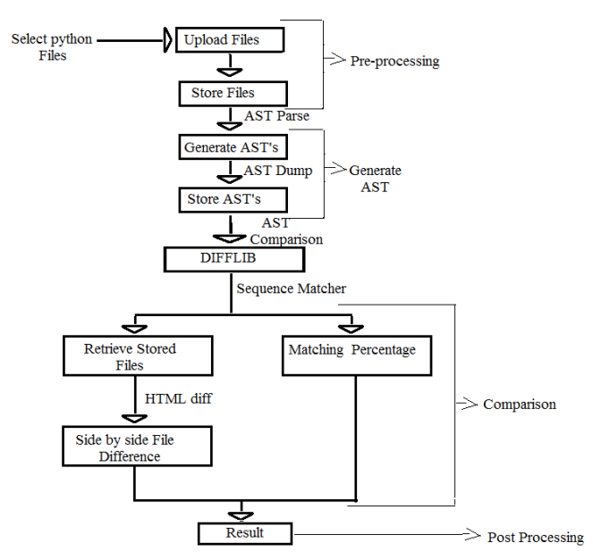
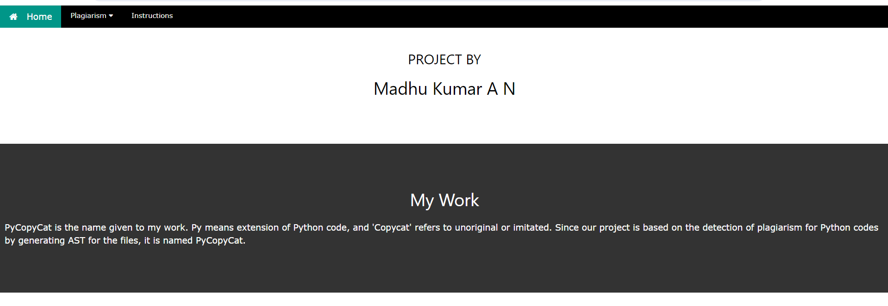
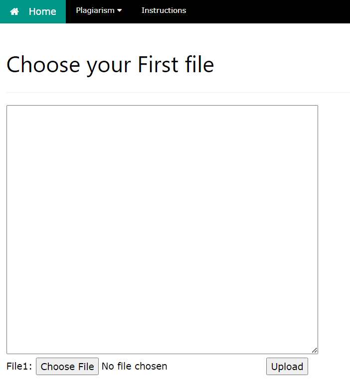
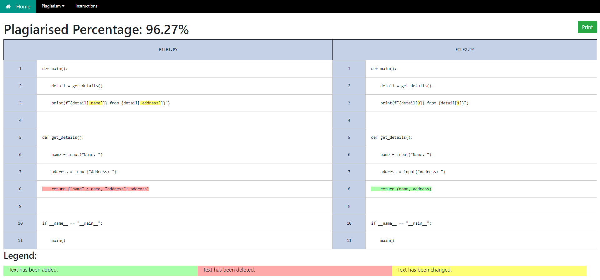

# PyCopyCat

## Introduction
PyCopyCat is a simple webapp written in Django to check plagiarism among Python files using AST and SequenceMatcher.

## Installation

### Requirements
The PyCopyCat app requires `Python3` and `Django`. Install the requirements by:
`pip install -r requirements.txt`

### Installation
Clone the repo or download the zip.
Create a virtual environment inside the CompareIt directory, activate the virtualenv and install the requirements.
```
python3 -m venv venv
source venv/bin/activate
pip install -r requirements.txt
```
## How to start

Finally, run `python manage.py runserver` to run the local server and access the local server from `127.0.0.1:8080`.
## Features

CompareIt project was bulid to check plagiarism among the Python files with following options:
- `File to File` : 2 python files are uploaded and checked for plagiarism
- `File to Files` : A single python file is uploaded and folder containing multiple files are uploaded and checked for plagiarism against each python files.
- `Folder files` : In Folder Files comparison, a folder containing multiple files are uploaded and checked for plagiarism among the files in the uploaded folder.
- Moredetails : option is added to get in detail percentage of plagiarism by comparing file-file for `File to Files` and `Folder files`


## Data Flow Diagram


Two important Modules used:
- `ast` : AST stands for Abstract Syntax Tree.

    Is a tree representation of the abstract syntactic structure source code written in a programming language. Each node of tree denotes a construct occurring in the source code. 

- `difflib` : Two Classes are used `SequenceMatcher` and 
 `HtmlDiff` for in details refer https://docs.python.org/3/library/difflib.html.

 
## Usage
Make sure to change os.chdir() to your complete path in the following files.
- Compareit/folderfilescmp.py
- Compareit/newfilesmatch.py


## Issues Faced

Issues faced during the project and solution.

- This project was build using `Python3` and `Django2.0.2`

    ```   
    from django.conf.urls import url

     Where url in path is not available in present Django version, so had to replace url with path in urls.py
     ```

## Screenshots






